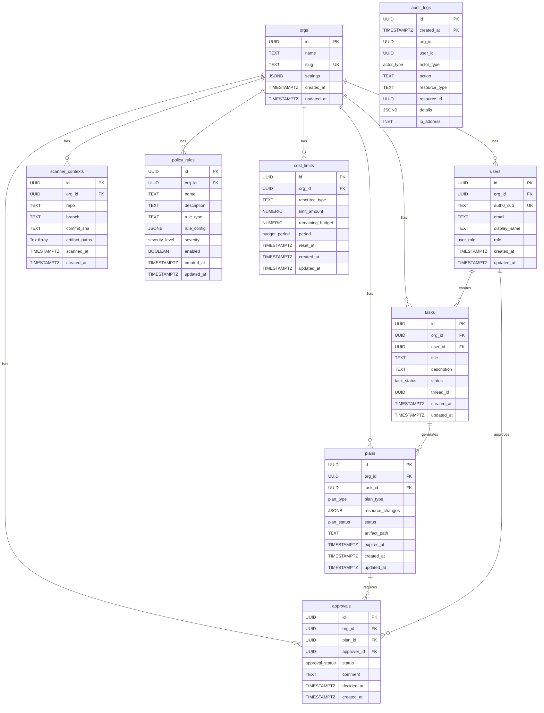

# Entity Relationship Diagram

## CE Tables (public schema)

> `audit_logs` is range-partitioned by `created_at` (monthly). It has no foreign keys by design -- audit records survive org deletion.

## EE Tables (ee schema)

```mermaid
erDiagram
    ee_agent_memories {
        UUID id PK
        UUID org_id FK
        memory_type memory_type
        TEXT key
        JSONB value
        UUID source_task_id FK
        NUMERIC relevance_score
        NUMERIC decay_factor
        INTEGER access_count
        TIMESTAMPTZ created_at
        TIMESTAMPTZ updated_at
    }

    ee_discovery_scans {
        UUID id PK
        UUID org_id FK
        cloud_provider provider
        TextArray regions
        TextArray resource_types
        scan_status status
        TEXT error_message
        TEXT result_path
        INTEGER resource_count
        TIMESTAMPTZ created_at
    }

    ee_mcp_registry {
        UUID id PK
        UUID org_id FK
        TEXT name
        TEXT endpoint_url
        mcp_auth_type auth_type
        TEXT credentials_ref
        JSONB tool_manifest
        mcp_health_status health_status
        TIMESTAMPTZ created_at
        TIMESTAMPTZ updated_at
    }

    ee_organizations {
        UUID org_id PK
        TEXT billing_email
        TEXT billing_plan
        TEXT sso_provider
        JSONB sso_config
        JSONB feature_flags
        INTEGER max_users
        INTEGER max_teams
        TIMESTAMPTZ created_at
        TIMESTAMPTZ updated_at
    }

    ee_teams {
        UUID id PK
        UUID org_id FK
        TEXT name
        TEXT description
        TIMESTAMPTZ created_at
        TIMESTAMPTZ updated_at
    }

    ee_org_members {
        UUID org_id PK
        UUID user_id PK
        UUID team_id FK
        TEXT role
        TIMESTAMPTZ joined_at
    }

    ee_org_quotas {
        UUID id PK
        UUID org_id FK
        TEXT resource_type
        INTEGER limit_value
        INTEGER current_usage
        TIMESTAMPTZ created_at
        TIMESTAMPTZ updated_at
    }

    ee_notification_preferences {
        UUID id PK
        UUID org_id FK
        UUID user_id FK
        TextArray event_types
        JSONB channels
        BOOLEAN enabled
        TIMESTAMPTZ created_at
        TIMESTAMPTZ updated_at
    }

    ee_channel_configs {
        UUID id PK
        UUID org_id FK
        channel_type channel_type
        TEXT name
        JSONB config
        TEXT credentials_ref
        BOOLEAN enabled
        TIMESTAMPTZ created_at
        TIMESTAMPTZ updated_at
    }

    ee_governance_policies {
        UUID id PK
        UUID org_id FK
        TEXT policy_type
        TEXT name
        JSONB config
        BOOLEAN enabled
        TIMESTAMPTZ created_at
        TIMESTAMPTZ updated_at
    }

    ee_approval_rules {
        UUID id PK
        UUID org_id FK
        TEXT name
        TEXT risk_level
        INTEGER required_approvers
        JSONB conditions
        BOOLEAN enabled
        TIMESTAMPTZ created_at
        TIMESTAMPTZ updated_at
    }

    ee_dashboard_aggregates {
        UUID id PK
        UUID org_id FK
        TEXT metric_name
        NUMERIC metric_value
        JSONB dimensions
        TIMESTAMPTZ period_start
        TIMESTAMPTZ period_end
        TIMESTAMPTZ created_at
    }

    ee_reports {
        UUID id PK
        UUID org_id FK
        TEXT name
        TEXT report_type
        TEXT format
        JSONB parameters
        TEXT artifact_path
        TIMESTAMPTZ created_at
        TIMESTAMPTZ updated_at
    }

    ee_report_schedules {
        UUID id PK
        UUID org_id FK
        UUID report_id FK
        TEXT cron_expression
        BOOLEAN enabled
        TIMESTAMPTZ next_run_at
        TIMESTAMPTZ created_at
        TIMESTAMPTZ updated_at
    }

    ee_attestations {
        UUID id PK
        UUID org_id FK
        UUID plan_id FK
        UUID attester_id FK
        TEXT attestation_type
        JSONB evidence
        TIMESTAMPTZ attested_at
        TIMESTAMPTZ created_at
    }

    ee_licenses {
        UUID id PK
        UUID org_id FK
        TEXT license_key UK
        TEXT license_type
        INTEGER max_users
        JSONB features
        TIMESTAMPTZ valid_from
        TIMESTAMPTZ valid_until
        TEXT status
        TIMESTAMPTZ created_at
        TIMESTAMPTZ updated_at
    }

    ee_license_usage {
        UUID id PK
        UUID license_id FK
        UUID org_id FK
        INTEGER active_users
        JSONB features_used
        TIMESTAMPTZ recorded_at
        TIMESTAMPTZ created_at
    }

    ee_agent_memories }o--|| tasks : "source_task"
    ee_reports ||--o{ ee_report_schedules : "scheduled_by"
    ee_teams ||--o{ ee_org_members : "contains"
    ee_licenses ||--o{ ee_license_usage : "tracks"
    ee_attestations }o--|| plans : "attests"
    ee_attestations }o--|| users : "attested_by"
    ee_org_members }o--|| users : "is"
    ee_notification_preferences }o--|| users : "for"
```

## Cross-Schema FK Summary

All EE tables reference `public.orgs(id)` via `org_id`. Additional cross-schema FKs:

| EE Table | Column | References |
|----------|--------|------------|
| `ee.agent_memories` | `source_task_id` | `public.tasks(id)` |
| `ee.org_members` | `user_id` | `public.users(id)` |
| `ee.notification_preferences` | `user_id` | `public.users(id)` |
| `ee.attestations` | `plan_id` | `public.plans(id)` |
| `ee.attestations` | `attester_id` | `public.users(id)` |
